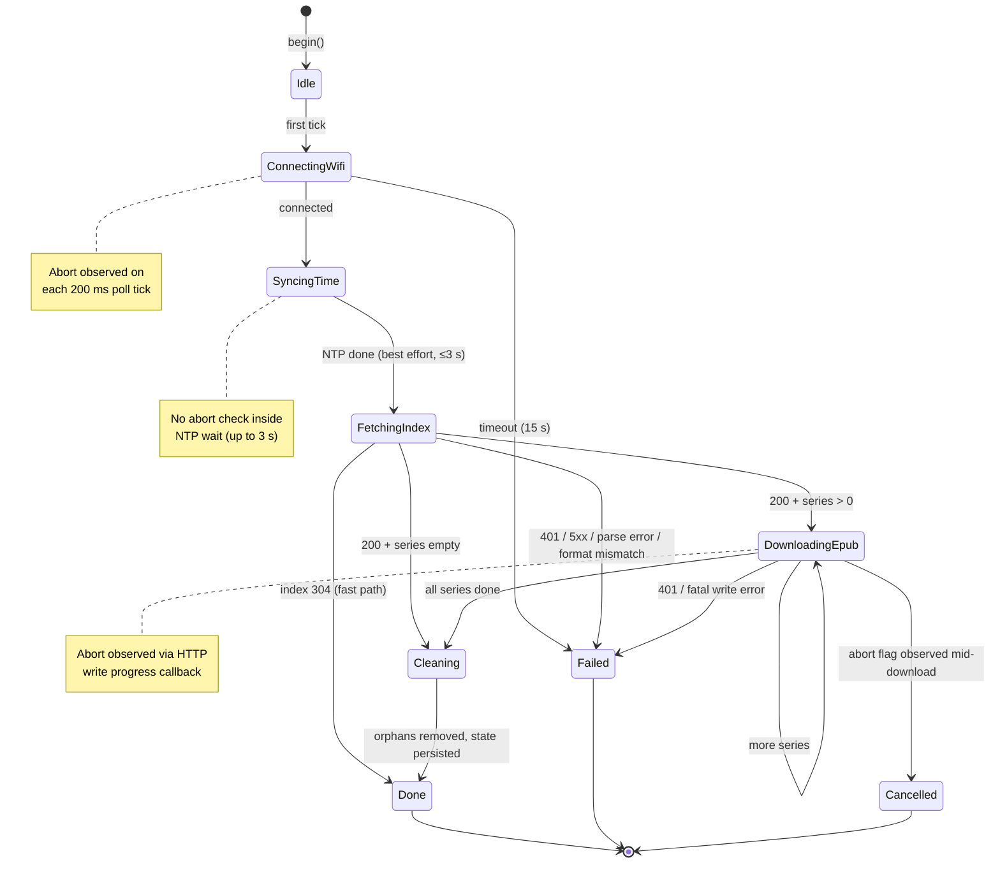
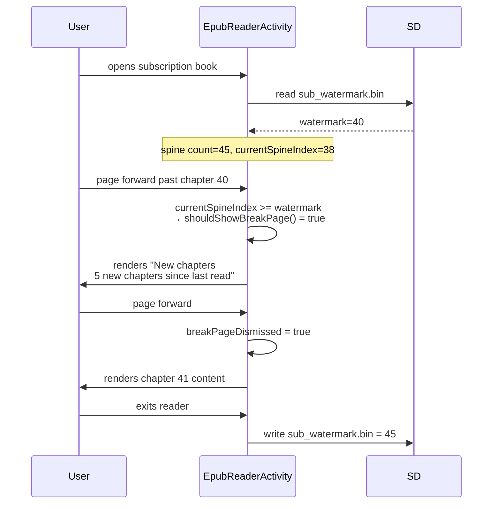

# Subscription Sync — Device Internals

Device-side implementation guide for the subscription sync feature. For the server wire contract (endpoints, JSON shapes, EPUB generation rules) see [subscription-sync.md](./subscription-sync.md).

Audience: firmware contributors touching any file under `src/network/Subscription*` or the Subscriptions Inbox / break page UI.

---

## Component map

```text
┌────────────────────────── Main Task (Arduino loop) ──────────────────────────┐
│                                                                              │
│  main.cpp setup()                                                            │
│    └─ on PowerButton wake: SubscriptionSyncService::startIfIdle()            │
│                                                                              │
│  ActivityManager::loop()                                                     │
│    └─ currentActivity->loop()                                                │
│         ├─ SubscriptionsInboxActivity: polls service snapshot,               │
│         │   long-press Confirm routes to startIfIdle() / cancel()            │
│         └─ EpubReaderActivity: reads/writes sub_watermark.bin,               │
│             shows break page, auto-advances at book end                      │
│                                                                              │
│  ActivityManager::preventAutoSleep()                                         │
│    └─ returns true while syncer is running (blocks inactivity timeout)       │
└──────────────────────────────────────────────────────────────────────────────┘

┌──────────────────────── SubSync Task (4 KB stack) ───────────────────────────┐
│                                                                              │
│  SubscriptionSyncService::taskBody()                                         │
│    └─ SubscriptionSyncer::tick() loop                                        │
│         ├─ ConnectingWifi → SyncingTime → FetchingIndex                      │
│         ├─ DownloadingEpub (per series, with HTTP progress callback)         │
│         ├─ Cleaning (orphan removal, state.save())                           │
│         └─ Done / Failed / Cancelled                                         │
└──────────────────────────────────────────────────────────────────────────────┘

┌────────────────────────── Render Task (shared) ──────────────────────────────┐
│                                                                              │
│  Wakes on xTaskNotify from SubscriptionSyncService::publishProgress()        │
│   or any other requestUpdate() source. Redraws currentActivity.              │
└──────────────────────────────────────────────────────────────────────────────┘

┌──────────────────────── Persistent state on SD ──────────────────────────────┐
│                                                                              │
│  /.subscriptions/                                                            │
│    ├─ state.json             # ETags + per-series metadata                   │
│    ├─ <series-id>.epub       # downloaded EPUBs                              │
│    └─ <series-id>.epub.part  # in-flight download (atomic rename on success) │
│                                                                              │
│  /.crosspoint/epub_<hash>/                                                   │
│    ├─ book.bin               # deleted on re-download to force reparse       │
│    ├─ sections/              # preserved across re-downloads                 │
│    ├─ progress.bin           # preserved across re-downloads                 │
│    └─ sub_watermark.bin      # 2-byte LE spine count at last reader exit     │
└──────────────────────────────────────────────────────────────────────────────┘
```

---

## Threading model

Three FreeRTOS tasks are relevant:

| Task | Owner | Priority | Stack | Responsibilities |
|---|---|---|---|---|
| Main | Arduino `loop()` | 1 | 8 KB (system) | GPIO polling, activity loop, auto-sleep, pending action dispatch |
| SubSync | `SubscriptionSyncService` | 1 | 4 KB | Wi-Fi connect, NTP, HTTP GET, JSON parse, SD writes |
| Render | `ActivityManager` | 1 | 8 KB | Single-consumer of `renderingMutex`, calls `currentActivity->render()` |

ESP32-C3 is single-core. The three tasks alternate cooperatively. The SubSync task yields via `vTaskDelay(1)` between phases (`SubscriptionSyncService.cpp:123`) and via `delay(200)` inside the Wi-Fi connect loop (`SubscriptionSyncer.cpp:225`).

### Progress snapshot pattern

The service owns a mutex-guarded copy of the live progress. Writers and readers never touch the syncer's private `progress_` directly:

```text
 SubSync task                  Service mutex            UI tasks (inbox render)
 ────────────                  ─────────────            ───────────────────────
 syncer_.tick()
   └─ mutates syncer_.progress_
 publishProgress()
   └─ xSemaphoreTake ────────► [locked]
       service.progress_ = syncer_.progress()
       xSemaphoreGive ────────► [unlocked]
   └─ xTaskNotify(renderTask)
                                                       service.snapshot()
                                                         └─ xSemaphoreTake
                                                             copy = service.progress_
                                                             xSemaphoreGive
                                                         returns copy
```

`snapshot()`, `isRunning()`, and `lastResult()` all take the same mutex briefly. They are safe to call from any task.

---

## Phase state machine

Defined in `SubscriptionSyncer::Phase` (`SubscriptionSyncer.h:23-33`). Each `tick()` advances at most one step.



### Failure reasons

`FailureReason` (`SubscriptionSyncer.h:35-44`):

| Reason | Caused by | User-facing string |
|---|---|---|
| `NoCredentials` | `WIFI_STORE.getCredentials().empty()` at `begin()` | `STR_SYNC_FAIL_NO_CREDS` |
| `WifiConnect` | 15 s timeout waiting for `WL_CONNECTED` | `STR_SYNC_FAIL_WIFI` |
| `IndexFetch` | Non-2xx/3xx/4xx on index (treated as transport) | `STR_SYNC_FAIL_INDEX` |
| `IndexParse` | `deserializeJson` error | `STR_SYNC_FAIL_PARSE` |
| `UnsupportedFormat` | `formatVersion != 1` | `STR_SYNC_FAIL_FORMAT` |
| `Unauthorized` | 401 on index or any series | `STR_SYNC_FAIL_AUTH` |
| `ServerError` | 5xx on index or series, or rename failure | `STR_SYNC_FAIL_SERVER` |

404 on an individual series is **not** terminal — the sync logs and skips that series (`SubscriptionSyncer.cpp:376-379`).

---

## Component responsibilities

### `SubscriptionSyncer` (`src/network/SubscriptionSyncer.{h,cpp}`)

Pure state-machine logic, no tasks or locks. Owns:

- The current `Progress` struct (phase, current title, byte counters, failure reason).
- The loaded-but-not-yet-persisted view of the index (`seriesFromIndex_`).
- The list of orphan IDs computed at index-parse time (`orphanIds_`).
- The cached `SubscriptionState` (loaded on `begin()`, saved on `Cleaning`).
- The abort flag (set by `cancel()`, observed by `tick()` and progress callback).

`tick()` is the only method that mutates the state machine. The owning task calls it in a loop; if `isTerminal()` returns true, `tick()` is a no-op.

### `SubscriptionSyncService` (`src/network/SubscriptionSyncService.{h,cpp}`)

Singleton. Owns the SubSync FreeRTOS task, the progress mutex, and the last-result record. Provides the only supported entry points for the rest of the firmware:

- `startIfIdle()` — returns `false` if preconditions fail or a sync is already running.
- `cancel()` — no-op if not running.
- `isRunning()`, `snapshot()`, `lastResult()` — mutex-guarded reads.

The service installs a progress listener on the syncer so that long HTTP transfers publish byte-level progress without needing to drive the state machine at that granularity.

### `SubscriptionState` (`src/network/SubscriptionState.{h,cpp}`)

Pure data + serialization. Knows about:

- `state.json` shape and format versioning (currently `2`, with `1` readable in best-effort mode).
- The watermark sidecar format (2-byte little-endian unsigned int).
- The EPUB cache path derivation (`std::hash<std::string>{}(filepath)`) — this must mirror `Epub::cachePath` exactly.

Exposes `unreadSeriesIds(excludedId)` for the reader's auto-advance.

### `SubscriptionsInboxActivity` (`src/activities/home/SubscriptionsInboxActivity.{h,cpp}`)

UI-only. Reads state + watermarks from SD on enter and after every completed sync. Renders:

- The header "Subscriptions".
- The sync banner (running phase + current title + progress bar, or last failure reason, or "Synced X ago").
- Two list sections: "New chapters" (watermark < spine count) and "Caught up" (everything else).
- Button hints: Home / Open / prev / next, with "Sync" or "Cancel" subtitle on the Open hint advertising the long-press action.

Long-press Confirm (≥1000 ms) toggles `startIfIdle()` / `cancel()`. A latch flag (`syncTriggeredByLongPress`) prevents the release from firing short-press Open.

### `EpubReaderActivity` (`src/activities/reader/EpubReaderActivity.{h,cpp}`)

Detects subscription status on `onEnter()` by attempting to read `sub_watermark.bin`. If present, `isSubscription = true` and `watermarkSpineCount` is loaded. This drives two behaviors:

1. **Break page**: shown exactly once when `currentSpineIndex >= watermarkSpineCount`, dismissed by a forward page turn. See `shouldShowBreakPage()` / `renderBreakPage()`.
2. **Watermark re-arm**: on `onExit()`, writes the current spine count back so the next sync's additions become the next break-page trigger.
3. **Auto-advance**: at end-of-book (`currentSpineIndex >= spine count` + forward press), calls `tryAutoAdvanceToNextSubscription()` which picks the most-recently-synced other subscription with unread chapters.

---

## Cancellation semantics

`cancel()` sets `abortRequested_` on the syncer. The task observes it at different granularities depending on phase:

| Phase | Worst-case cancel latency | Check site |
|---|---|---|
| `Idle` / `Done` / `Failed` / `Cancelled` | Immediate (no-op; already terminal) | n/a |
| `ConnectingWifi` | ~200 ms | `SubscriptionSyncer.cpp:224` (inside wait loop) |
| `SyncingTime` | ~3 s (no check inside NTP wait) | n/a |
| `FetchingIndex` | Blocks until HTTP GET returns | `HttpDownloader::fetchConditional` has no cancel hook |
| `DownloadingEpub` | Next HTTP write chunk (~tens of ms) | Progress callback returns `false` → aborts `writeToStream` |
| `Cleaning` | Not interruptible | Runs to completion |

On observed abort, the task lands on `Phase::Cancelled` (not `Failed`) if the trigger was the user flag, and cleans up the `.part` file. Wi-Fi is torn down via `teardownWifi()` on the way out.

---

## Persistent state

### `state.json` — `/.subscriptions/state.json`

```json
{
  "formatVersion": 2,
  "indexEtag": "W/\"...\"",
  "seriesEtags": { "<id>": "W/\"...\"", ... },
  "seriesMeta": {
    "<id>": {
      "title": "...",
      "localPath": "/.subscriptions/<id>.epub",
      "lastSyncedMs": 1712956800000,
      "lastKnownSpineCount": 42
    }
  }
}
```

- Written after every successful per-series download (crash-resilience: a mid-sync crash doesn't force re-downloads).
- Rewritten during `Cleaning` with orphaned entries removed.
- Format `1` loads in best-effort mode (ETags preserved, `seriesMeta` repopulates on next successful download).

### Watermark sidecar — `/.crosspoint/epub_<hash>/sub_watermark.bin`

Two bytes, little-endian unsigned int. Presence of the file marks the EPUB as a subscription.

- **Seeded** by the syncer on first download at `0` — a fresh subscribe reports every chapter as unread so the inbox surfaces the series under "New chapters". The reader suppresses the break page when `watermark == 0` to avoid a "— N new chapters —" interstitial before the user has read anything.
- **Re-armed** by the reader on `onExit()` to the current spine count, after which subsequent syncs that grow the spine will trigger the break page on next open.
- **Never overwritten** by subsequent syncs — the reader owns the file after the initial seed.

### EPUB files — `/.subscriptions/<series-id>.epub`

Downloaded atomically: written to `<series-id>.epub.part`, then renamed on successful completion. The rename replaces any existing `.epub` atomically on most filesystems; on failure the `.part` file is removed.

---

## Cache invalidation on re-download

When a series is re-downloaded (index etag mismatch, server returns 200), the syncer invalidates just enough of the cache to force the reader to reparse the spine but keep user-visible state:

| File | Action | Why |
|---|---|---|
| `<id>.epub` | Atomic replace | New content |
| `book.bin` | Deleted | Spine has grown; force `Epub::load` to reparse |
| `sections/` | Preserved | Chapter-N layout for existing chapters is still valid (stable-index invariant) |
| `progress.bin` | Preserved | User's reading position is still valid |
| `sub_watermark.bin` | Preserved | The reader owns this; sync only seeds it when absent |

This relies on the server honoring the append-only, stable-spine-index invariant documented in `subscription-sync.md`. If the server inserts a chapter mid-spine, `sections/` and `progress.bin` will point at the wrong chapter — but that's a server contract violation, not a device bug.

An **unsubscribe** (series no longer in the index) nukes the entire cache dir via `Storage.removeDir()` during `Cleaning`.

---

## Reader integration

### Break page



`shouldShowBreakPage()` combines these conditions:

- `isSubscription` (sidecar exists) AND
- `!breakPageDismissed` (not yet dismissed this session) AND
- `watermarkSpineCount > 0` (not a first-ever open — the syncer seeds freshly-subscribed series at `0`) AND
- `watermarkSpineCount < spineCount` (there are new chapters) AND
- `currentSpineIndex >= watermarkSpineCount` (user has reached them) AND
- `currentSpineIndex < spineCount` (not past the end).

### Watermark re-arm on exit

The reader writes the current spine count to the sidecar on every `onExit()` for subscription books, regardless of whether new chapters were read. The next sync's additions will re-widen the gap and re-arm the break page.

### Auto-advance at book end

When the user pages past the last chapter of a subscription book, `tryAutoAdvanceToNextSubscription()` is called instead of `onGoHome()`:

1. Load `SubscriptionState`.
2. Resolve the current series ID by matching `epub->getPath()` against stored `seriesMeta[*].localPath`.
3. Call `state.unreadSeriesIds(currentId)` — returns series with `watermark < lastKnownSpineCount`, sorted by `lastSyncedMs` descending.
4. If non-empty, `activityManager.goToReader(top_candidate.localPath)`; otherwise return `false` and the caller falls through to `onGoHome()`.

---

## Wi-Fi / NTP lifecycle

The syncer owns its Wi-Fi lifecycle and tears it down unconditionally when finished:

```text
begin()               Storage.mkdir, state.load, validate settings (no radio)
tick() ConnectingWifi WiFi.persistent(false); WiFi.mode(STA); WiFi.begin(...)
                      Poll every 200 ms up to 15 s
tick() SyncingTime    esp_sntp_init + poll up to 3 s
tick() FetchingIndex  HTTP GET (HTTPClient over NetworkClientSecure, setInsecure)
tick() DownloadingEpub HTTP GET per series
tick() Cleaning       SD writes only
teardownWifi()        esp_sntp_stop; WiFi.disconnect(false); WiFi.mode(OFF); 100ms
                      (called on every terminal path, including Failed / Cancelled)
```

### Interaction with other Wi-Fi consumers

The syncer does not coordinate with OPDS Browser, OTA updates, or the web server — each manages its own Wi-Fi. In practice the conflict is avoided because:

- Boot-path sync runs while the user is on Home or Reader, neither of which uses Wi-Fi.
- Inbox-triggered sync is only reachable from a non-Wi-Fi screen.
- Auto-sleep is blocked during sync, but not during OPDS browse or web server — a running sync prevents sleep from under those flows too.

If two flows try to own Wi-Fi concurrently (e.g., user navigates to OPDS while sync is running), behavior is undefined. This is a known limitation; in practice the flows that start Wi-Fi are behind user-initiated UI, and users don't trigger two at once.

---

## Storage concurrency

`HalStorage` serializes **both** its own top-level calls (`mkdir`, `exists`, `remove`, `rename`, `openFileForRead`, etc.) **and** every `HalFile` operation (`read`, `write`, `seek`, `close`, ...) behind a single internal mutex. Downstream code sees `FsFile` as an alias for the thread-safe `HalFile` wrapper — the raw SdFat `FsFile` is only visible inside `lib/hal/HalStorage.cpp` (guarded by `HAL_STORAGE_IMPL`).

See `lib/hal/HalStorage.cpp:127-148` — the `HAL_FILE_WRAPPED_CALL` macro acquires `StorageLock` (the storage mutex) before forwarding each operation to the underlying SdFat file.

The practical consequence:

- Any storage call from any task is safe; concurrent access is serialized by the mutex.
- The HTTP download's `FileWriteStream::write` writes ~1500-byte chunks through `HalFile::write`, which takes the mutex per chunk. Main-task SD calls serialize against those chunks but don't corrupt them.
- Long-running operations (a 2 MB EPUB download) hold the mutex briefly per chunk, not for the whole transfer — so reader activity state-saves and section loads can interleave between chunks without waiting for the entire download.

### Safe patterns

- Any call through `Storage` or a `HalFile` instance is mutex-protected.
- Short writes via `Storage.writeFile(path, content)` (entire write under a single lock).
- Reads via `Storage.readFile(path)` (entire read under a single lock).

### Contention considerations

- Mutex contention during a download is per-chunk, not per-byte. A 2 MB download acquires/releases the mutex ~1400 times (once per TCP chunk).
- If a future operation needs an atomic multi-call sequence on a `HalFile` (seek + read + seek, etc.), wrap it explicitly — but no current code path requires this.

---

## Auto-sleep interaction

`ActivityManager::preventAutoSleep()` returns `true` while the sync is running:

```cpp
bool ActivityManager::preventAutoSleep() const {
  if (SubscriptionSyncService::instance().isRunning()) return true;
  return currentActivity && currentActivity->preventAutoSleep();
}
```

This inhibits the inactivity timer in `main.cpp:352-357`, so a background sync can complete even if the user doesn't press any button.

**Not inhibited**: manual power-off (long-press Power). The user can force-sleep mid-download; the task dies, the `.part` file remains, Wi-Fi is left in whatever state it was in. Next boot's sync restarts the affected series from scratch.

---

## Boot trigger conditions

```cpp
if (wakeupReason == HalGPIO::WakeupReason::PowerButton && !HalSystem::isRebootFromPanic()) {
  SubscriptionSyncService::instance().startIfIdle();
}
```

| Wake source | Sync runs? |
|---|---|
| First boot (cold power-on) | No — `wakeupReason` is not `PowerButton` |
| Power-button wake from deep sleep | Yes |
| USB plug-in wake | No — wake reason differs |
| Reboot from panic | No — explicitly suppressed to avoid panic loops interfering with sync |
| Manual via Inbox long-press | Yes (user-initiated) |

`startIfIdle()` itself is a no-op if subscriptions aren't enabled, URL/token aren't configured, or no Wi-Fi credentials are saved. It's safe to call unconditionally.

---

## Failure modes & recovery

| Scenario | What happens | Next run recovery |
|---|---|---|
| Wi-Fi timeout | `Failed` with `WifiConnect`; Inbox shows failure banner | Next sync retries from scratch |
| Index 401 | `Failed` with `Unauthorized` | Not retried until user reconfigures token |
| Index 5xx | `Failed` with `ServerError` | Next sync retries |
| Series 404 | Skipped, sync continues | That series omitted until server publishes it again |
| Series 5xx | `Failed` with `ServerError`; partial `.part` removed | Next sync retries that series + downstream |
| Mid-download crash/reset | `.part` remains on SD; etag not persisted | Next sync sees etag mismatch, re-downloads (overwrites `.part`) |
| Mid-download deep sleep (power-off) | Same as crash | Same as crash |
| NTP failure | `lastSyncedMs` may be 0 or boot-relative | Cosmetic; inbox ordering degrades |
| Index parse failure | `Failed` with `IndexParse`; local state untouched | Next sync retries (guardrail prevents wiping local state on malformed response) |
| Format version mismatch | `Failed` with `UnsupportedFormat` | Requires firmware update |

Orphan `.part` cleanup is **not** currently implemented — stale `.part` files accumulate if the server drops a series before the first successful download completes. Sweep at sync start would fix this.

---

## UX surface map

### Subscriptions Inbox — sync running

```text
┌─────────────────────────────────────────┐
│  Subscriptions                  ▮▮▮ 82% │
├─────────────────────────────────────────┤
│                                         │
│           Downloading                   │  ← phaseLabel()
│       Breakers of the Wheel             │  ← current title (truncated)
│    ▰▰▰▰▰▰▰▰▰▰▰▱▱▱▱▱▱▱▱▱  62%            │  ← progress bar (bytes)
│                                         │
├─────────────────────────────────────────┤
│  New chapters                           │
│  ▶ Sky Pride                       +3   │
│    He Who Fights With Monsters     +1   │
│                                         │
│  Caught up                              │
│    Arcane Ascension                     │
│                                         │
├────┬────────┬────┬────┐                 │
│Home│ Open   │ ▲  │ ▼  │                 │
│    │ Cancel │    │    │  ← subtitle on Open = long-press hint
└────┴────────┴────┴────┘
```

### Subscriptions Inbox — not configured

The "not configured" branch replaces the list with explanatory text and routes Confirm to the settings web server via `goToFileTransfer()`. The user configures URL + token from a phone or laptop, exits the web server, re-enters the Inbox, and sees the normal list.

### Break page in reader

Rendered by `EpubReaderActivity::renderBreakPage()` when the user pages into unread chapters. Dismissed by a single forward page turn.

### Settings

- **Device settings** (`SettingsActivity`): toggle, server URL, bearer token (obfuscated).
- **Web settings** (same fields, plus "Test Connection" button hitting `/api/subscriptions/test` in `CrossPointWebServer.cpp:1267`).

---

## Settings surface

| Field | Type | Storage | Exposed in |
|---|---|---|---|
| `subscriptionsEnabled` | `uint8_t` | `CrossPointSettings.h:203` | Device settings, web UI |
| `subscriptionServerUrl` | `char[256]` | `CrossPointSettings.h:204` | Device settings, web UI |
| `subscriptionBearerToken` | `char[128]`, obfuscated | `CrossPointSettings.h:205` | Device settings, web UI |

URL normalization is done at sync time (not at save time) via `SubscriptionSyncer::normalizeServerUrl()` — trailing slashes and a trailing `/v1/subs/index.json` suffix are stripped. This lets users paste the full endpoint URL from docs and still get a valid base.

---

## Diagnostics

### Log tags

| Tag | Source |
|---|---|
| `SUB` | Syncer, service, state (most subscription activity) |
| `HTTP` | `HttpDownloader` (progress, write errors, byte counts, memory snapshots) |
| `ERS` | `EpubReaderActivity` (watermark read/write, break page, auto-advance) |
| `WEB` | Settings web server (including `/api/subscriptions/test`) |
| `ACT` | `ActivityManager` (activity transitions) |

### Healthy sync — 304 fast path

```
[SUB] Loaded state: indexEtag=W/"abc", 5 series, 5 meta
[SUB] Connecting to SSID: HomeWifi
[SUB] Wi-Fi connected, IP=10.0.0.42
[HTTP] Conditional fetch: https://.../v1/subs/index.json (etag=W/"abc")
[HTTP] 304 Not Modified
[SUB] Index unchanged (304)
[SUB] Sync task exiting, stack high water: 2812
```

Elapsed: ~2-3 s including Wi-Fi connect.

### Healthy sync — one series updated

```
[SUB] Index parsed: 5 series, 0 orphans
[SUB] Downloading series 'royalroad-107917' (2457600 bytes expected) ...
[HTTP] Begin download: 2457600 bytes -> /.subscriptions/royalroad-107917.epub.part
[HTTP] Download progress: 65536/2457600 bytes (2%) free=184392
[HTTP] Download progress: 131072/2457600 bytes (5%) free=184304
...
[HTTP] Download complete: 2457600 bytes in 18432ms (free=184216)
[SUB] Series 'royalroad-107917' downloaded (2457600 bytes)
[SUB] Sync task exiting, stack high water: 2618
```

### Common diagnostic questions

- **"Sync is slow"** — check `[HTTP] Begin download` and `[HTTP] Download complete` timestamps. Per-byte progress lines appear every 64 KB.
- **"Inbox says failed"** — check for `[SUB]` line with the failure reason. The banner maps `FailureReason` → translated string; the log has the raw HTTP code or parser error.
- **"Break page didn't show"** — `[ERS] Subscription detected, watermark=N, spineCount=M` confirms detection. If absent, the sidecar wasn't seeded; trigger a sync.
- **"New chapters didn't appear after sync"** — check `book.bin` invalidation log line and that the reader activity reopened the book after sync (open EPUB holds stale spine).

### Forcing states for manual testing

- **Clear ETags (force full resync)**: `rm /.subscriptions/state.json` on SD.
- **Clear a specific series cache**: `rm -rf /.crosspoint/epub_<hash>/`.
- **Simulate "new chapters available"**: manually decrement the value in `sub_watermark.bin` (2 bytes, little-endian).
- **Reproduce "not configured" state**: set `subscriptionsEnabled = 0` in settings.

---

## Known issues

- **Orphan `.part` files** aren't swept at sync start. If a mid-download crash is followed by the server dropping that series, the `.part` file is leaked on SD.

These are tracked separately; this doc describes intended behavior. When fixing, update this section accordingly.
